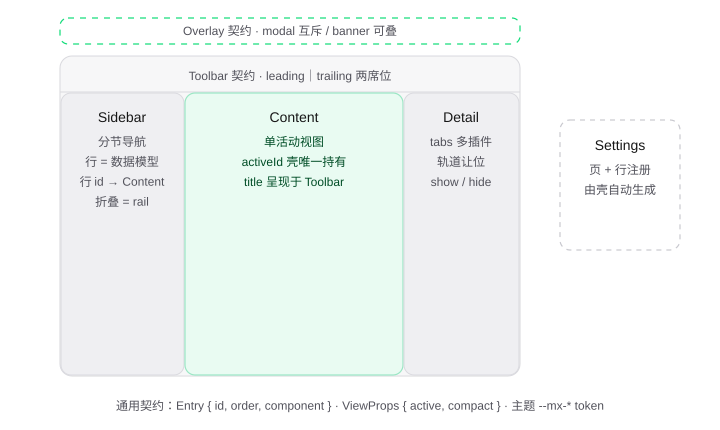

# 组件层契约

| 项 | 值 |
| --- | --- |
| 归属 | mindx-work · UI 框架（shell） |
| 状态 | v1 定稿（2026-09-24） |
| 职责 | 定义"界面长什么样、谁来提供内容"——全部界面契约 |
| 不负责 | 装配过程（bootstrap 另起一篇）、业务语义、通信协议、状态管理实现 |

---

## 1. 定位与边界

本契约描述一个**构建类 Mac 应用的 UI 框架**的组件层：AppShell 的视图区构成、各视图区的条目模型、壳与插件之间的全部接口。MindX Agent 工作台只是该框架的第一个客户，由预置插件运行时组装而成。

三条硬边界（验收标准）：

1. **零业务词汇**——框架 API 中不出现"会话、agent、工具、消息"等业务概念。用本框架做邮件客户端、文件管理器，框架代码零改动。
2. **渲染库无关**——内核对组件类型不透明（`component: unknown`），由薄适配器（`shell-react` / `shell-vue`）收窄类型并负责渲染。选 React 还是 Vue + Pinia 是一行选型，不是架构决策。
3. **框架不做状态管理**——插件内部状态用所在生态惯用法；跨插件只有 `services` 一条通道；框架自身只持有视图区条目与编排状态（机制状态，壳唯一写）。

## 2. 界面解剖



八个契约锚点：Toolbar（Content 顶部工具栏两席位）、Sidebar（分节导航）、Content（单活动视图）、Detail（DetailToolbar + 轨道）、Overlay（全局浮层）、Sheet（全屏抽层）、Floater（可拖动浮窗）、Settings（独立面板）。每个视图区对应下文一节契约，条目注册后渲染在图中对应位置。

## 3. 通用条目模型

```ts
// 内核级通用条目，C 由适配器收窄为具体渲染类型（React.FC / Vue 组件）
interface Entry<C> {
  id: string          // 区内唯一，注册冲突启动期抛错
  order?: number      // 缺省 100，小者在前
  component: C        // 对内核不透明，适配器负责解释与渲染
}
```

```ts
// 图标引用：Iconify 名称，由壳的图标组件渲染（纪律见军规 9，机制见样式原语第 6 节）
type Glyph = string   // "{collection}:{name}"，如 "lucide:settings"
```

## 4. 视图区契约

### Sidebar — 分节导航

行是**数据模型**而非组件，由壳统一渲染（SwiftUI selection 语义）。侧栏分三段：Header 固定区（Logo、折叠按钮）、滚动区（节 + 行）、Footer 固定区（固定操作行）——Header / Footer 经组件席位注册，不随内容滚动，折叠成 rail 时仍渲染（组件经 ViewProps.compact 自适配）。侧栏宽度由壳承载：右缘拖拽手柄调节（双击重置），选中行为灰底深字（`--mx-selected`），折叠为 rail 后禁用拖拽。分节本身亦可整节交由组件渲染（**分节组件席位**：`rows` 为空且提供 `component`，折叠成 rail 时组件经 `compact` 自适配）——供插件自绘富分节（如会话列表）；`rows` 非空时行数据模型优先，组件不渲染。

```ts
interface SidebarView<C> {
  add(entry: Entry<C> & {
    title?: string      // 分节标题，零文案：不传就不渲染节头
    icon?: Glyph        // 折叠成 rail 时的替身
    rows: SidebarRow[]
  }): void
  remove(id: string): void
  addHeader(entry: Entry<C>): void  // 顶部固定区席位（Logo、折叠按钮）
  addFooter(entry: Entry<C>): void  // 底部固定区席位（固定操作行）
}

interface SidebarRow {
  id: string            // 必须对应一个 Content 条目 id，启动期校验
  label: string
  icon?: Glyph
  badge?: C             // 可选富元素：未读数、状态点
  variant?: 'button'    // 按钮卡形态（如"新会话"）：38 高 / 0.5px 边框 / radius 12 / elevated 填充，动作行不承载选中底
}
```

### Content — 单活动视图

```ts
interface ContentView<C> {
  add(entry: Entry<C> & { title?: string }): void  // title 呈现于 Toolbar
  remove(id: string): void
  // activeId 壳唯一写：Sidebar 行点击切换，初始 = order 最小条目
  // activate 是层模型激活链的起点：激活沿 Sidebar→Content→Detail 传播（见 §8）
}
```

### Detail — DetailToolbar + 轨道

条目归属解决多插件共存，轨道解决 Content 让位。轨道头部行为 **DetailToolbar 区**，
只有左右两侧：左为激活条目 Title（零文案壳自动呈现），右为尾段按钮组席位 +
壳固有关闭钮。**按钮组按条目私有**（`owner` 归属）：插件 A 的 Detail 激活时呈现
A 自己的按钮组，其它条目的按钮组隐藏——不是所有 Detail 共用一套。**Detail 内无
Tab 组件**：激活条目由编程式 `show / setActiveTab` 隐式切换，用户不手动切换
（各插件内部自行管理页签，如 web-viewer 浏览器页签）。

```ts
interface DetailView<C> {
  add(entry: Entry<C> & { title: string; icon?: Glyph; owner?: string }): void
  // owner 指向 Content 条目 id（层归属）：激活链联动切到此层；省略 = 独立唤起层
  //（无 Content 层的工具型插件，如 explorer / terminal，仅经 Detail.show 唤起）。
  // 启动期校验 owner 存在。
  remove(id: string): void  // 级联移除归属该条目的按钮组
  show(id?: string): void   // 编程开合，缺省激活首个条目；激活即隐式切换
  hide(): void
  setActiveTab(id: string): void  // 编程式激活条目（隐式切换的唯一通道）
  // DetailToolbar 尾段席位：owner 归属条目，每条目一套；注册时校验条目已存在（先 add 再 addToolbar）
  addToolbar(entry: Entry<C> & { owner: string }): void
  removeToolbar(id: string): void
  // 壳状态：shown + activeTab
}
```

### Overlay — 全局浮层

只收全局层；popover 这类贴着触发点的局部浮层由插件组件自己渲染。

```ts
type OverlayKind = 'modal' | 'banner'

interface OverlayView<C> {
  add(entry: Entry<C> & { kind: OverlayKind }): void
  remove(id: string): void  // 关闭 = 移除
  // modal 同时至多一个（互斥）；banner 顶部可堆叠
}
```

### Sheet — 全屏抽层

由下向上滑入覆盖整个界面的浮层级视图（抽屉语义），与 Overlay / Settings 同为壳级公共能力。头部是壳固有 chrome：注册者提供的 Title 居中呈现，尾端固有关闭钮（关闭 = 移除条目）。互斥单开（对齐 modal 互斥）；本体为注册者组件，填充头部以下全部空间。

```ts
interface SheetView<C> {
  add(entry: Entry<C> & { title: string }): void  // title 由壳渲染于头部居中
  remove(id: string): void  // 关闭 = 移除；同时至多一个（互斥，冲突抛错）
}
```

### Floater — 可拖动浮窗

无阻塞浮动件：风格与主窗浮层族一致（elevated 底 / window 圆角 / shadow-lv3 锐利边界），**无传统 titlebar**——头部为细带，左侧模拟 macOS 交通灯（仅红灯，点击关闭）+ 注册者提供的标题小字；按住头部拖动，clamp 保证头部始终可抓取。多条目并存（可多开），点击任意浮窗将其置顶；位置归适配层本地状态（刷新重置，持久化待定开放点）。尺寸可选声明（`width` / `height` px，缺省由适配层定）；无遮罩不阻塞、不抢 Esc（关闭通道 = 红灯 / 注册者自行 remove）。出现/消失动画经 `animation` 属性预设：`zoom`（缺省，放大出现、缩小消失）/ `fade`（纯淡入淡出）/ `none`（无动画），非法值抛错。

```ts
interface FloaterView<C> {
  add(entry: Entry<C> & { title: string; width?: number; height?: number; animation?: 'zoom' | 'fade' | 'none' }): void
  remove(id: string): void  // 关闭 = 移除；允许多开，不互斥
}
```

### Toolbar — 窗口工具栏

```ts
interface ToolbarView<C> {
  add(entry: Entry<C> & { slot: 'leading' | 'trailing'; owner?: string }): void
  // owner 指向 Content 条目 id（层归属，对齐 DetailToolbar）：仅该条目激活时呈现；
  // 省略 = 全局层恒显（壳级工具轨，如对话工作台的文件夹/浏览器/task/终端图标）。
  // 启动期校验 owner 存在。
  remove(id: string): void
}
```

### Settings — Preferences

设置面板由壳自动生成，注册者只提供页与行。

```ts
interface Preferences<C> {
  page(entry: Entry<C> & { title: string; icon?: Glyph }): void
  row(entry: Entry<C> & { page?: string }): void   // 缺省归入壳自带"通用"页
  remove(id: string): void
}
```

## 5. AppShell 总面与服务上下文

```ts
interface AppShell<C> {
  readonly Sidebar: SidebarView<C>
  readonly Content: ContentView<C>
  readonly Detail:  DetailView<C>
  readonly Overlay: OverlayView<C>
  readonly Sheet:   SheetView<C>
  readonly Floater: FloaterView<C>
  readonly Toolbar: ToolbarView<C>
  readonly Settings: Preferences<C>
  services: ServiceContext
}

// 插件间唯一共享通道；框架对实现零感知
interface ServiceContext {
  provide(name: string, impl: unknown): void  // 同名重复提供 = 编程错误，启动期抛出
  use<T>(name: string): T                     // 未提供时抛出——依赖缺失在启动期暴露
}
```

## 6. 壳传给条目组件的 UI 事实

按视图区选用，宁可少传。业务数据不走 props——props 只有界面事实。

```ts
interface ViewProps {
  active?: boolean    // Content / Detail：当前是否呈现
  compact?: boolean   // Sidebar：折叠成 rail
}
```

## 7. 插件义务

```ts
// 插件 = 一个函数 + 一个可选清理函数；类型取自 App 所选适配器收窄后的 AppShell
export default (app: AppShell) => {
  app.Sidebar.add({ id: 'jobs', order: 30, component: JobsPanel })
  return () => { /* 卸载/热更时调用 */ }
}
```

壳自己只干四件事（机制清单，与渲染库正交）：启动装配（执行插件清单、启动期暴露冲突与缺失）、视图渲染与编排、生命周期（dispose / 热更 = 重执行插件函数）、服务解析。装配过程（清单来源、执行顺序、错误报告格式）由 bootstrap 篇另述。

## 8. 编排语义（关键决策）

1. **导航联动归框架**：Sidebar 行 → Content 条目靠 id 映射，选中态壳唯一持有，插件零连线；行 id 找不到 Content 条目 → 启动期报错。
2. **Overlay 收窄**：全局层只有 modal（互斥）与 banner（可叠）；popover 归插件局部渲染。全屏抽层是独立视图区 Sheet（互斥单开，头部壳固有 chrome：居中 Title + 尾端关闭钮）；可拖动浮窗是独立视图区 Floater（多开并存，交通灯红灯关闭）——护栏与自由度的分界线。
3. **Detail 双语义合一**：条目归属（多插件共存）+ 轨道（Content 让位），`show / hide` 是壳的编排 API；头部行 DetailToolbar 区左 Title 右尾段按钮组，无 Tab 组件（隐式切换），按钮组按条目私有（owner 归属，激活谁显示谁的）。
4. **层模型（激活链）**：激活的主体是条目组（同 owner 的 Toolbar/Detail 条目 = 一个插件的层），激活沿 **Sidebar→Content→Detail** 单向传播，用户不手动切层——呈现由激活者决定（同 iOS Stack View 的层显隐心智）。规则：
   - Toolbar 席位 = 全局层（owner 省略，恒显）+ 激活层（owner 命中活动条目）叠放；
   - Detail 联动**展开才切**：轨道已展开且激活者有 owner 归属的 Detail 层 → 切到该层（order 最小）；缺区回退——无则保持原内容不动；轨道收起时不联动、不自动弹出；
   - 独立唤起层（owner 省略的 Detail 条目）不参与激活链，仅经 `Detail.show` 唤起；
   - owner 指向的 Content 条目不存在 → 启动期报错（对齐 Sidebar 行校验）。

## 9. 样式与文案纪律

- 主题 token 一律 `--mx-*` 命名空间（背景 / 表面 / 文本 / 弱文本 / 边框 / accent / 危险 / 成功，清单实现期定稿）；亮暗切换归壳；插件组件**禁止书写字面色值**。
- **零文案壳**：壳骨架不含任何文案，标题、按钮文字全部由注册者提供。
- 视图区几何（宽度、让位）由壳计算，条目组件不自算布局边界。

## 10. 契约变更规则

- 新增**可选**字段不破坏契约；删除或改语义需升版本。
- 硬约束不可协商：条目 id 区内唯一、Sidebar 行 id → Content 映射校验、modal / sheet 互斥、`--mx-*` token 纪律、零文案壳。

## 11. 开放点（不影响契约闭合）

- `app.navigate(id)` 编程跳转（深链 / 通知场景）——等真实需求。
- Detail 独占模式（占满中栏）——v1 不做。
- macOS 菜单栏——属宿主（Electron / Tauri）侧，框架不管。

## 附：概念对账

| 维度 | 本契约 | 对照：deepseek-harness |
| --- | --- | --- |
| 概念 | 5 个（AppShell / View / Entry / Preferences / Service） | 10+（slot / seat / occupant / ledger / fiber / inject face…） |
| 动词 | 4 个（add / remove / provide / use） | 分散在多套 API |
| 生命周期 | 2 个（启动 / 清理） | cordis fiber 状态机 |
| 状态管理 | 不做（界面层自决） | 自研 observable ledger |
